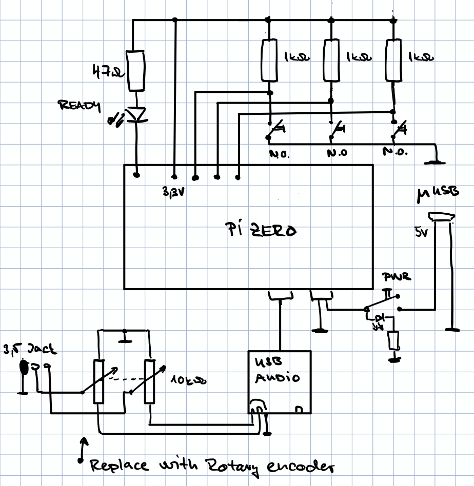
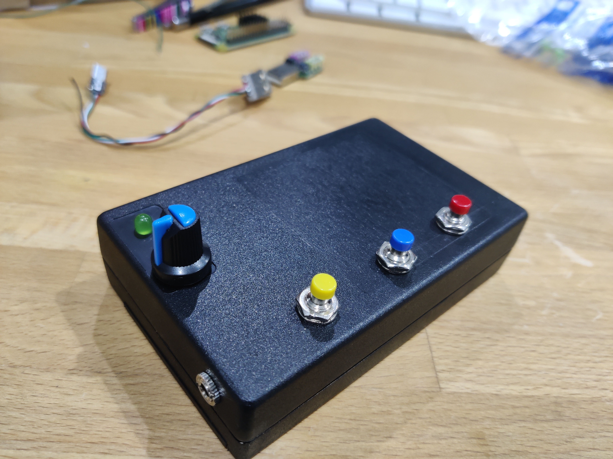
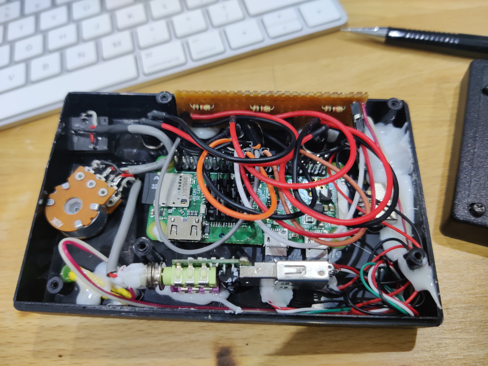
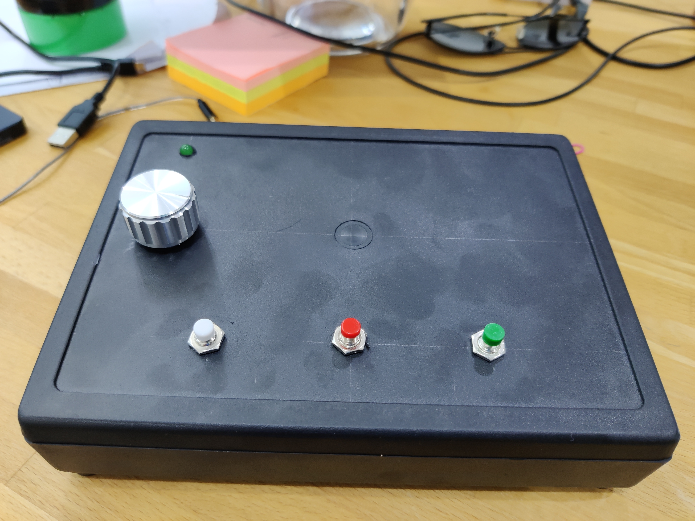
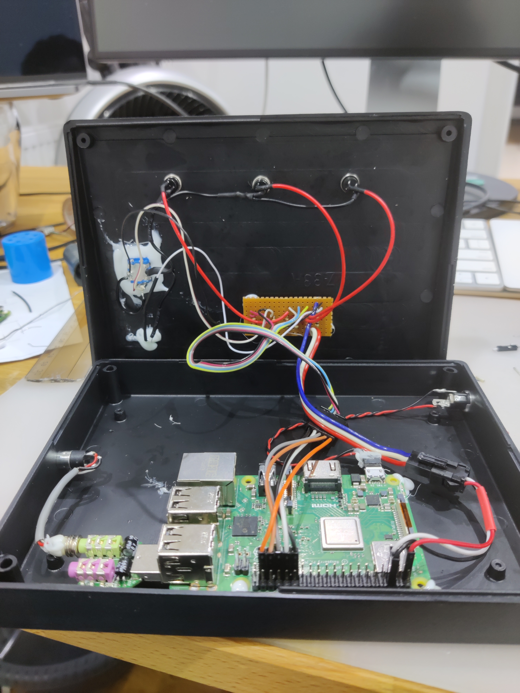

# Reproductor de Audiolibros basado en Raspberry (Pi ZeroW o 3B)
## Motivación y requisitos
Mi padre es prácticamente ciego y, a sus 80 años, tiene dificultades para escuchar y manejar controles electrónicos pequeños o más complicados. Las pantallas táctiles, los teléfonos inteligentes, los teclados y los reproductores MP3 pequeños están completamente descartados. He probado usar un pequeño reproductor MP3 de botones (Sencor) con 5 botones (anterior, siguiente, reproducir/pausa, subir/bajar volumen) como evaluación inicial de si sería capaz de controlar un reproductor de audiolibros. Aunque lo usó, le resultaba difícil controlarlo y el pequeño reproductor con controles de botones sobrecargados (2-3x) era demasiado. Además, carecía de una opción fundamental: la actualización remota de libros. Así que decidí construir un reproductor personalizado con los siguientes requisitos:
- El control de volumen sea un codificador rotativo incremental
- Mantener el número de botones al mínimo (separados entre sí - resistentes a toques accidentales)
- Permitir cambios remotos de contenido - wifi
- Contenido abierto (no bloqueado a un editor)
- No necesita funcionar con baterías
- Nivel mínimo de indicadores de estado
- Volumen de salida suficiente para impulsar altavoces/auriculares

## Instalación
### Sistema
Ejecute raspi-config y configure el sistema
Instale algunos paquetes del sistema.
```
sudo apt-get install python3 evtest mpd mpc ntp vim screen git pigpiod libasound2-dev ffmpeg
```

Crear directorio de datos
```
sudo mkdir /data && sudo chown pi /data && chmod 755 /data
```

Edite /etc/mpd.conf y cambie el directorio a /data
`music_directory         "/data"`
Agregar definición de dispositivo de audio
```
audio_output {
        type            "alsa" 
        name            "My ALSA Device" 
        device          "hw:1,0"        # optional 
}
```

Configure el overlay del codificador rotativo y desactive Bluetooth y el audio a bordo agregando lo siguiente a /boot/config.txt
```
# add rotary encoder
dtoverlay=rotary-encoder,pin_a=19,pin_b=26,relative_axis=1

# disable builtin audio - we are using external usb card
dtparam=audio=off

# disable BT
dtoverlay=disable-bt

# Disable arm boost
arm_boost=0

# Disable vc4-kms-v3d audio
dtoverlay=vc4-kms-v3d,audio=off
```
### Tarjeta de sonido USB Alsa
Edite /usr/share/alsa/alsa.conf
```
defaults.ctl.card 1
defaults.pcm.card 1
```

### Dirección estática
Configure la dirección estática y los resolvers en `/etc/dhcpcd.conf`
```
interface wlan0
static ip_address=192.168.1.30/24
static routers=192.168.1.1
static domain_name_servers=192.168.1.1 8.8.8.8
```

Crontab bajo el usuario para descargar en /data/.news.mp3
```
crontab -e 
*/5 * * * * /usr/bin/curl -L -f -s -o /data/tmp/.news.mp3 https://www.uid0.sk/users/adino/dl/news.mp3
* * * * * /home/pi/Pi0AudioBook/time_and_newsgen.sh > /dev/null 2>&1
*/5 * * * /home/pi/Pi0AudioBook/zurnal.sh > /dev/null 2>&1
```

#### Endurecimiento de la memoria flash (Flash hardening)
Debido a que el sistema utiliza memoria flash, es posible que la tarjeta SD se desgaste con el tiempo. Hay un par de cosas que podemos hacer para prevenir esto.
Desactive el intercambio (swap) y los procesos que escriben frecuentemente.
```
apt-get remove --purge wolfram-engine triggerhappy anacron logrotate xserver-common lightdm
apt-get autoremove --purge
```
Edite `/etc/dphys-swapfile` y establezca `CONF_SWAPSIZE=0`
Verifique con `free`, el swap debería ser 0.

Edite `/etc/mpd.conf` y configure `log_file` para que registre en `/var/lib/mpd` en lugar de `/var/log/mpd`.
```
log_file /var/lib/mpd/mpd.log"
```
En mpd.conf agregue la entrada para la tarjeta de audio:
```
audio_output {
     type            "alsa"
     name            "My ALSA Device"
     device          "hw:1,0"        # optional
}

```

Modifique `/etc/fstab` y agregue:
```
tmpfs    /tmp    tmpfs    defaults,noatime,nosuid,size=100m    0 0
tmpfs    /var/tmp    tmpfs    defaults,noatime,nosuid,size=30m    0 0
tmpfs    /var/lib/mpd    tmpfs    defaults,noatime,nosuid,size=30m    0 0
tmpfs    /var/log    tmpfs    defaults,noatime,nosuid,mode=0755,size=100m    0 0
tmpfs    /data/tmp    tmpfs    defaults,noatime,nosuid,mode=0777,size=100m    0 0

```
`/var/log` es opcional. No debería tener mucha actividad ahora que mpd registra en /var/lib/mpd. Use `iotop -o -b -d 10` para verificar qué está escribiendo en la memoria flash.

### Ayudantes de bash
Agregue `~/.bash_aliases` con dos alias:
```
alias knihaeject='sudo service mpd stop; sudo service knihaui stop; rm -fr /data/*.mp3'
alias knihaload='sudo service mpd start && sudo service knihaui start'
```

### Dependencias
Use venv para gestionar las dependencias
```
sudo apt-get install python3-venv
```

```
python3 -mvenv env
activate env with `source env/bin/activate`
pip3 install gpiozero
pip3 install pigpio
pip3 install python-mpd2
pip3 install evdev
pip3 install pyalsaaudio
pip3 install --upgrade google-api-python-client
pip3 install google-cloud-texttospeech
pip3 install beautifulsoup4
```

Configuración del servicio
```
sudo cp *.service /etc/system.d/system # or create symlinks
sudo systemctl daemon-reload
sudo systemctl enable wifi-restart
sudo systemctl enable knihaui
systemctl enable kniha-newsinit.service
```

### knihaui.py
* El usuario pi en la Raspberry PI Zero tiene este repositorio clonado en la carpeta Pi0AudioBook.
* También existe la carpeta `/data` en la raíz, escribible por el usuario pi. 
* `/etc/rc.local` se modifica para desactivar la salida de video, establecer el volumen PCM en 100, configurar los pines de E/S y establecer los permisos en `/data`
  `source /home/pi/Pi0AudioBook/knihaui-init.sh`
* Tenemos `wifi_restart.sh` y la definición de servicio relacionada para hacer ping y reiniciar el wifi automáticamente.
* `/etc/systemd/system/knihaui.service` se encarga de ejecutar la interfaz de usuario.
* El servicio se habilita con `systemctl enable knihaui`. 
* MPD está instalado y habilitado en el sistema, ejecutándose en el puerto 6600 y utilizando `/data` como directorio de medios.
* Los componentes no utilizados o adicionales están deshabilitados. Mantenemos avahi para la resolución de nombres.
* Para prolongar la vida útil de la tarjeta SD, descargue [overlayfs](https://github.com/ghollingworth/overlayfs) y úselo según las instrucciones en el readme.

### newsgen.py
* descargue el certificado del proyecto de Google Cloud a `env/newsgen-credentials.json`
Para ejecutar:
* `export GOOGLE_APPLICATION_CREDENTIALS=env/newsgen-credentials.json`
* `source env/bin/activate`
* Ejecutar `python3 newsgen.py` crea `/tmp/news.mp3` si tiene éxito

Escuche [aquí un ejemplo breve en eslovaco](example_brief_sk.mp3)

Automatice con crontab.


## V0
V0 fue el conjunto de scripts para dividir audiolibros grandes en archivos pequeños manejables, adecuados para reproductores básicos. Esto también permitía añadir una voz que dijera "capítulo X" al inicio de cada fragmento.

## V1
V1 es el montaje físico con botones que mi padre está utilizando ahora mismo.
- [x] Montar el hardware usando Pi zero W
- [x] Interfaz de usuario en Python que controla los botones y gestiona MPD
- [x] Probar capacidad de actualización remota - SSH
- [x] Agregar soporte para radios por internet (SRo y Radio Litera)
- [x] Agregar documentación de la modificación del sistema de Raspbian a este documento

## V2
- [x] HW: Reemplazar potenciómetro por codificador rotativo y establecer el volumen principal directamente usando Alsa
- [x] HW: Usar una caja más grande - y usar Raspberry PI 3B - mayor estabilidad wifi
- [x] SW: Control de volumen con interruptor rotativo
- [x] SW: Solicitud de usuario para tener información del día disponible como otra estación
- [x] OS: Modo de montaje de solo lectura para prolongar la vida útil de la tarjeta SD

## V3
- [ ] HW: Reemplazar botones por otros de mejor calidad
- [ ] HW: Agregar ventilador de 5V para manejar mejor la temperatura
- [ ] HW: Agregar salida de puerto serial a un conector externo para mejorar la resolución de problemas 
- [ ] HW: Agregar interruptor basculante con indicador para permitir encender/apagar y una indicación inmediata de encendido
- [ ] HW: Cablear el botón pulsador del selector rotativo para funcionalidad extendida
- [ ] SW: Usar dtoverlay para el procesamiento de botones - funciona bien para rotativos y simplifica el procesamiento de eventos
- [ ] OS: Consola serial

## Esquema


## Fotografías
### V1



### V2


