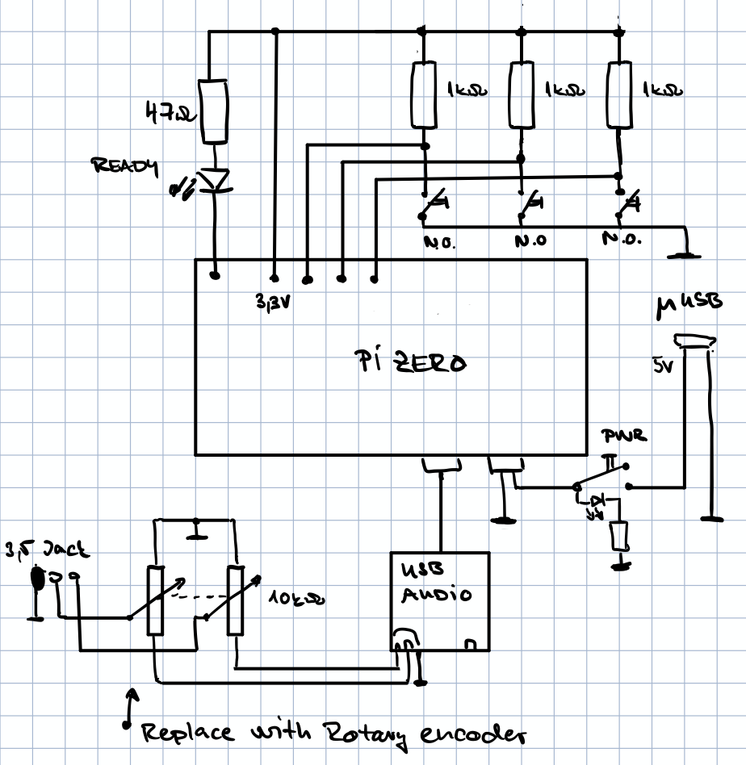
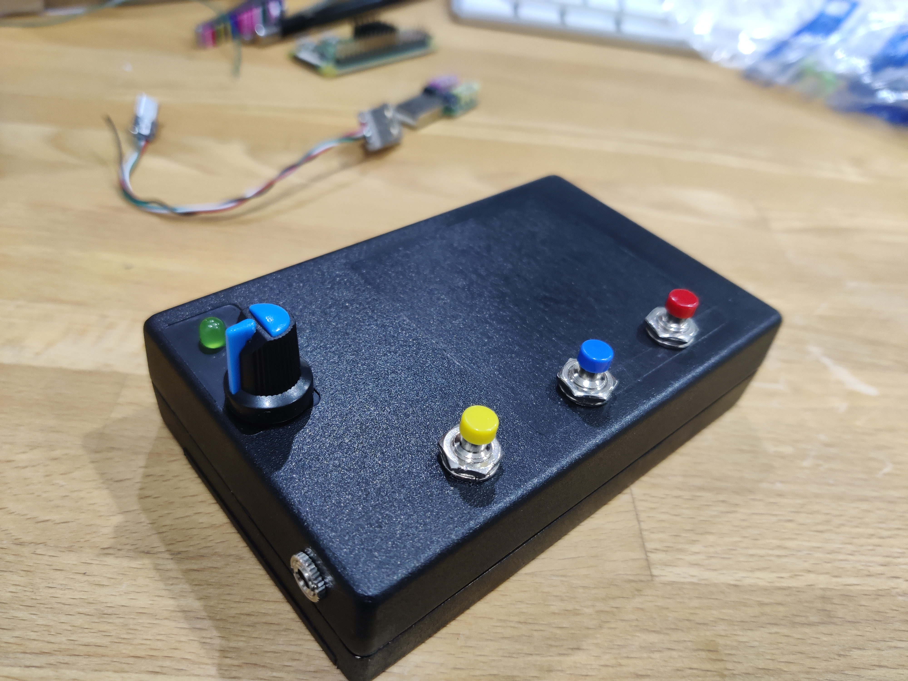
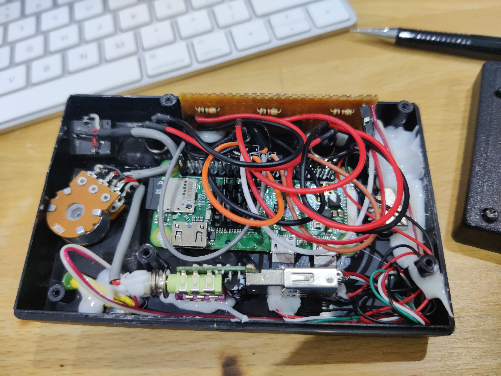

# PI Zero W Audio Book
## Motivation and requirements
My dad is practically blind and at 80 years has trouble hearing and operating tiny or more complicated electronics controls. Touch screens, smart phones, keyboards, and small mp3 players are completely out of the picture. I have tried using small dummy MP3 player (Sencor) with 5 buttons (prev, next, play|pause, volume up/down) as an initial assessment whether audio book player is something he would be able to control. Even though he uesd it, he was struggling with controlling it and the small player with 2-3x overloaded button controlls was too much. Also it lacked a fundamental option of remote book update. So I've decided to build custom player with following requirements:
- volume control is an analog knob (ideally it turns off all the way to the left)
- keep the number of buttons to minimum (spaced far apart - resilient to random touch)
- allow remote content change - wifi
- open content (not locked to a publisher)
- does not need to be battery operated
- minimal level of state indicators
- sufficient output volume to drive speakers/headphones

## Install
User pi on PI0W has this repo checked out under knihaui folder. There is folder /data on the root writable by pi user. 
/etc/rc.local is modified to disable video output, set PCM volume to 100, set IO pins and set permissions
Also we can add wifi_restarh.sh & to automatically try to restart wifi if it stops pinging the router.
/etc/systemd/system/knihaui.service takes care of running the UI
Service is enabled with systemctl enable knihaui. 
MPD is installed and enabled on the system running on port 6600 and using /data for media directory.
Unused or extra components are disabled. We keep avahi for name discovery.

Download https://github.com/ghollingworth/overlayfs and use as per instructions in readme.

### newsgen.py
* initialize venv with `python3 -mvenv env`
* activate env with `source env/bin/activate`
* pip3 install google-cloud-texttospeech
* download project certificate from google cloud to env/newsgen-credentials.json`
To run:
* `export GOOGLE_APPLICATION_CREDENTIALS=env/newsgen-credentials.json`
* `source env/bin/activate`
* Running `python3 newsgen.py` creates `/tmp/news.mp3` if successful

Listen to [Example brief in Slovak here](example_brief_sk.mp3)

Automate with crontab.

## V0
V0 was the set of scripts to slice larger audio books into manageable small files suitable for dumb players. This also allowed to prepend "chapter X" voice at the start of each slice.

## V1
V1 is the physical build with buttons that my dad is using right now.
- [x] Build hardware using Pi zero W
- [x] PY UI that drives the buttons and controlls MPD
- [x] Test remotre upgrade capability - SSH
- [x] Add support for internet radios (SRo and Radio Litera)
- [x] Add doc of system modification of raspbian to this doc

## V2
- [ ] HW: Add serial port output to external connector for improved troubleshooting 
- [ ] HW: Replace potentiometer with rotary encoder and set master volume directly using Alsa
- [ ] HW: Add rocker switch with indicator to allow turn off/on and immediate powered-on indication
- [ ] OS: Serial console
- [ ] SW: rotary switch volume control
- [x] SW: user request to have information about the day available as another station
- [x] OS: read-only mount mode to prolong SD card lifetime

## Schematic

## Photos

