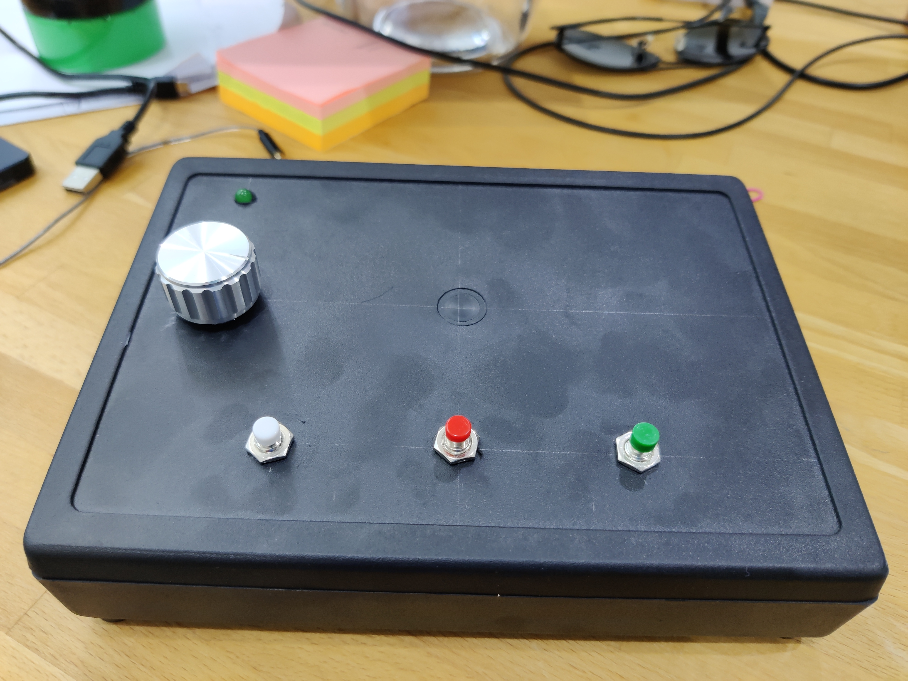
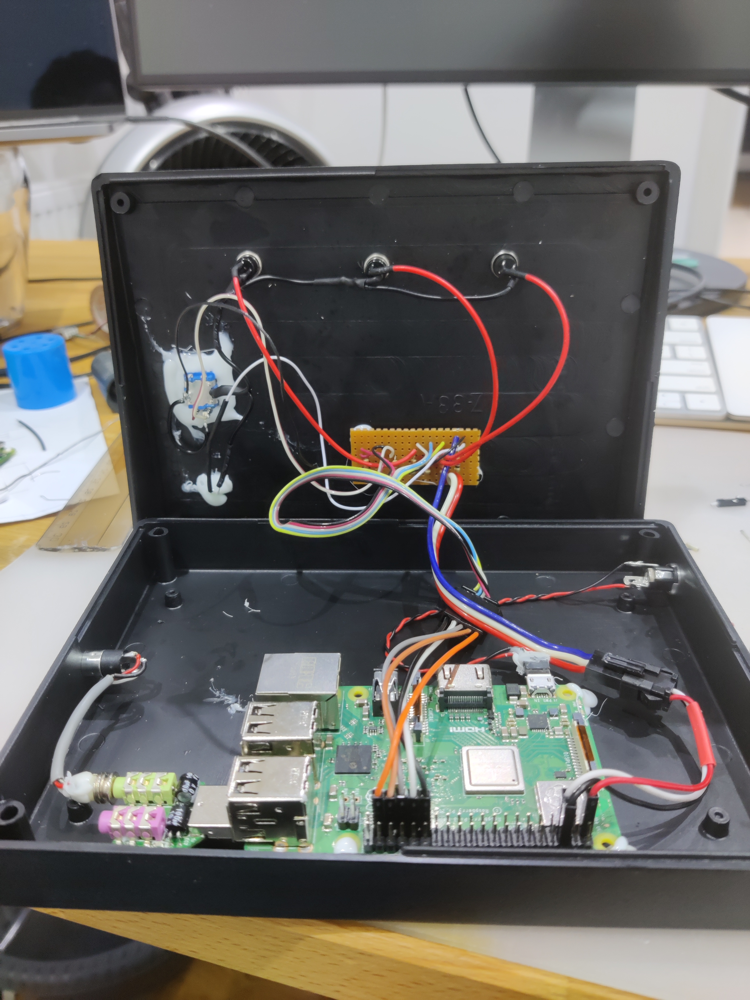

# Raspberry based Audio Book (Pi ZeroW or 3B)
## Motivation and requirements
My dad is practically blind and at 80 years has trouble hearing and operating tiny or more complicated electronics controls. Touch screens, smart phones, keyboards, and small mp3 players are completely out of the picture. I have tried using small dummy MP3 player (Sencor) with 5 buttons (prev, next, play|pause, volume up/down) as an initial assessment whether audio book player is something he would be able to control. Even though he used it, he was struggling with controlling it and the small player with 2-3x overloaded button controlls was too much. Also it lacked a fundamental option of remote book update. So I've decided to build custom player with following requirements:
- volume control is an incremental rotary encoder
- keep the number of buttons to minimum (spaced far apart - resilient to random touch)
- allow remote content change - wifi
- open content (not locked to a publisher)
- does not need to be battery operated
- minimal level of state indicators
- sufficient output volume to drive speakers/headphones

## Install
### System
run raspi-config and set the system up
Install some system packages.
```
sudo apt-get install python3 evtest mpd mpc ntp vim screen git gpio pigpiod libasound2-dev
```

Create data dir
```
mkdir /data && chown pi /data && chmod 755 /data
```

Edit /etc/mpd.conf and change directory to /data

Set the rotary encoder overlay and disable Bluetooth and onboard audio adding to /boot/config.txt
```
# add rotarty encoder
dtoverlay=rotary-encoder,pin_a=19,pin_b=26,relative_axis=1

# disable builtin audio - we are using external usb card
dtparam=audio=off

# disable BT
dtoverlay=disable-bt
```

Crontab under user to fetch into /data/.news.mp3
```
crontab -e 
*/5 * * * * /usr/bin/curl -f -s -o /data/tmp/.news.mp3 http://www.uid0.sk/users/adino/dl/news.mp3
* * * * * /home/pi/Pi0AudioBook/time_and_newsgen.sh > /dev/null 2>&1
*/5 * * * /home/pi/Pi0AudioBook/zurnal.sh > /dev/null 2>&1
```

#### Flash hardening
Due to the system using flash, it might happen that the SD card eventually wears out. There are couple of things we can do to prevent this.
Disable swap and frequent writers.
```
apt-get remove --purge wolfram-engine triggerhappy anacron logrotate xserver-common lightdm
apt-get autoremove --purge
```
Edit `/etc/dphys-swapfile` and set `CONF_SWAPSIZE=0`
Verify with `free`, swap should be 0.

Edit `/etc/mpd.conf` and make `log_file` log to `/var/lib/mpd` rather than `/var/log/mpd`.
```
log_file /var/lib/mpd/mpd.log"
```

Modify `/etc/fstab` and add:
```
tmpfs    /tmp    tmpfs    defaults,noatime,nosuid,size=100m    0 0
tmpfs    /var/tmp    tmpfs    defaults,noatime,nosuid,size=30m    0 0
tmpfs    /var/lib/mpd    tmpfs    defaults,noatime,nosuid,size=30m    0 0
tmpfs    /var/log    tmpfs    defaults,noatime,nosuid,mode=0755,size=100m    0 0

```
`/var/log` is optional. It should not be very busy with mpd now logging to /var/lib/mpd. Use `iotop -o -b -d 10` to check what is writing to the flash.

### Dependencies
Use venv for managing dependencies
```
sudo apt-get install python3-venv
```

```
python3 -mvenv env
activate env with `source env/bin/activate`
pip3 install gpiozero
pip3 install python-mpd2
pip3 install evdev
pip3 install pyalsaaudio
pip3 install --upgrade google-api-python-client
pip3 install google-cloud-texttospeech
pip3 install beautifulsoup4
```

Service setup
```
sudo cp *.service /etc/system.d/system # or create symlinks
sudo systemctl daemon-reload
sudo systemctl enable wifi-restart
sudo systemctl enable knihaui
```

### knihaui.py
* User pi on Raspberry PI Zero has this repo checked out under Pi0AudioBook folder.
* There is also folder `/data` on the root writable by pi user. 
* `/etc/rc.local` is modified to disable video output, set PCM volume to 100, set IO pins and set permissions on `/data`
* We have `wifi_restart.sh` and related service definition to automatically ping and restart wifi.
* `/etc/systemd/system/knihaui.service` takes care of running the UI.
* Service is enabled with `systemctl enable knihaui`. 
* MPD is installed and enabled on the system running on port 6600 and using `/data` for media directory.
* Unused or extra components are disabled. We keep avahi for name discovery.
* To prolong SD card lifetime download [overlayfs](https://github.com/ghollingworth/overlayfs) and use as per instructions in readme.

### newsgen.py
* download project certificate from google cloud to env/newsgen-credentials.json`
To run:
* `export GOOGLE_APPLICATION_CREDENTIALS=env/newsgen-credentials.json`
* `source env/bin/activate`
* Running `python3 newsgen.py` creates `/tmp/news.mp3` if successful

Listen to [Example brief in Slovak here](example_brief_sk.mp3)

Automate with crontab.


## V0
V0 was the set of scripts to slice larger audio books into manageable small files suitable for dumb players. This also allowed to prepend "chapter X" voice at the start of each slice.

## V1
V1 is the physical build with buttons that my dad is using right now.
- [x] Build hardware using Pi zero W
- [x] PY UI that drives the buttons and controlls MPD
- [x] Test remotre upgrade capability - SSH
- [x] Add support for internet radios (SRo and Radio Litera)
- [x] Add doc of system modification of raspbian to this doc

## V2
- [x] HW: Replace potentiometer with rotary encoder and set master volume directly using Alsa
- [x] HW: Use bigger case - and use Raspberry PI 3B - better wifi stability
- [x] SW: Rotary switch volume control
- [x] SW: user request to have information about the day available as another station
- [x] OS: read-only mount mode to prolong SD card lifetime

## V3
- [ ] HW: Replace buttons for a better quality ones
- [ ] HW: Add 5V fan to manage temperature better
- [ ] HW: Add serial port output to external connector for improved troubleshooting 
- [ ] HW: Add rocker switch with indicator to allow turn off/on and immediate powered-on indication
- [ ] HW: Wire rotary selector push button for extended functionality
- [ ] SW: Use dtoverlay for button processing - works well for rotary and simplify event processing
- [ ] OS: Serial console

## Schematic


## Photos
### V1


### V2



